# Log-Ratio Registration concept illustrations, measured

Eleven text-free illustrations of the log-ratio registration method, in the execution
order of
[`log_ratio_registration_concepts_explained.md`](../../log_ratio_registration_concepts_explained.md).
They replace the drawn set in [`../registration-concepts/`](../registration-concepts/README.md)
with one built from real data: every image is a frame of a real recording and every
number, mask, surface and trajectory is what the project's own Python engine, `ripr`,
produced when it ran on those pixels.

The recording is position 1424 of the Auto-Organotypic demonstration set - an Olympus LV200
bioluminescence and fluorescence time-lapse of an organotypic suprachiasmatic nucleus
slice. 240 timepoints, four channels (Bioluminescence, BF, RFP, GFP), 512 by 512
pixels at 2.0 um, half-hourly across five days. Registration is estimated on
brightfield, because estimating on a channel whose own brightness is the measurement
would let the cells register to themselves.

**Read the caption.** The set is text-free by design, so it can sit beside a Java,
Python or R write-up without translation, and nothing in the images is labelled: what
each element means is written here.

**One caveat that shapes the whole set.** This recording drifts by about 4.0
pixels horizontally and 2.2 vertically across the entire five days. That is a
real and well-behaved result, and it is also almost invisible at a glance. Where a
true-to-scale arrow would be too small to see, the figure exaggerates it by a stated
factor and the caption says so. No image, mask, surface, trace or fit is exaggerated -
only arrows.

Each figure is a self-contained bundle: the sources it was measured from, the derived
intermediates it draws, the standalone producer that renders it, and the master itself.


## 1. Resolve the measurement plane and the recipe

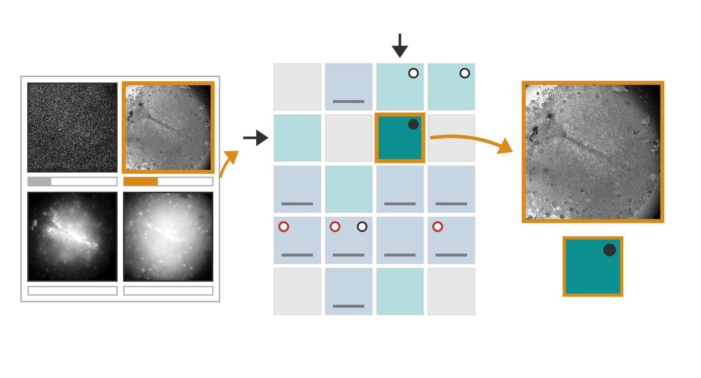

The four recorded channels of one timepoint enter as one hyperstack. The bar under each channel is how much correlation a one-pixel displacement costs it, drawn against the poor-localisability threshold at the bar's full width: brightfield is the best of the four and every channel still falls short of that threshold, which is why the recipe is declared rather than inferred. The declared image class picks a row of the fixed five-by-four recipe matrix and the declared motion class picks a column; fill colour is the robust norm, the dark dot marks a recipe that filters before estimating, the bar marks one that restricts which pixels count, and the red ring marks one that runs the second-pass pixel selection. The resolved cell and the brightfield plane leave together.

Bundle: [`01-resolve-measurement-and-recipe/`](01-resolve-measurement-and-recipe/README.md)

## 2. Prepare the estimation images and take logarithms

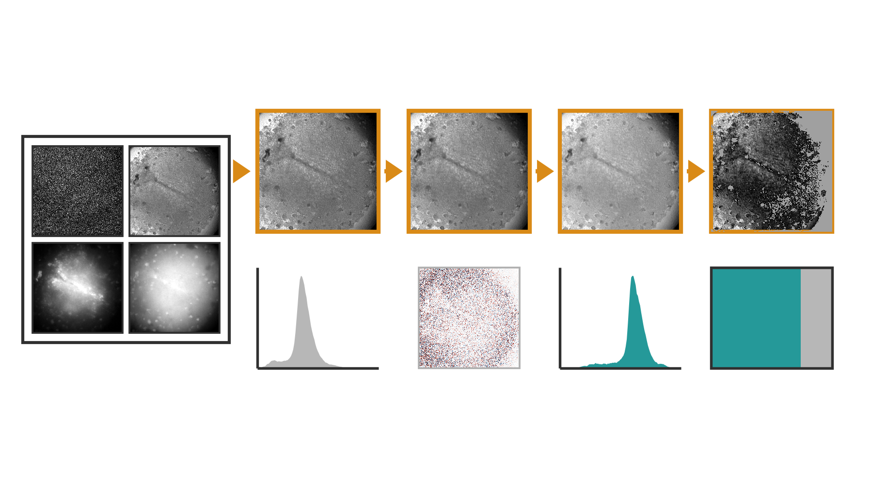

The untouched stack on the left is never written to; one copy of the brightfield plane leaves it and everything to the right happens to that copy. The chain is the raw plane, the three-by-three median the resolved recipe asks for, the base-2 logarithm of intensity plus one, and the same plane with an intensity band applied. Underneath: the intensity histogram before the logarithm and after it, the map of exactly which pixels the median filter moved and by how much, and the share of pixels the band keeps against the share it invalidates. The three tiles look alike on purpose - the logarithm does not change what the frame shows, it changes the distribution the estimator works in.

Bundle: [`02-prepare-and-log/`](02-prepare-and-log/README.md)

## 3. Set the search range and build pyramids

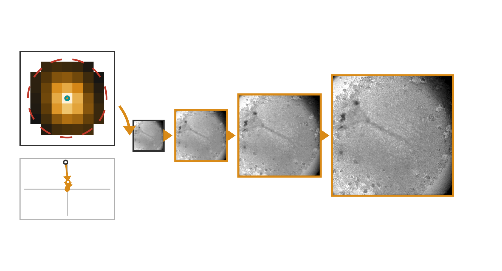

Left is the real cost of every integer displacement tested at the coarsest pyramid level, brightest where the two frames agree best; the orange dot is the integer position the search kept. The teal circle is the largest displacement the preliminary pass actually measured anywhere in this recording and the dashed red circle is the search bound the engine kept, which stays at the public floor because the measured motion is far smaller than it. Right, the same plane at each pyramid level, coarse to fine, and the path the refinement took through them: each step is where that level left the pair, plotted relative to the final answer.

Bundle: [`03-search-bound-and-pyramid/`](03-search-bound-and-pyramid/README.md)

## 4. Plan the frame-pair graph

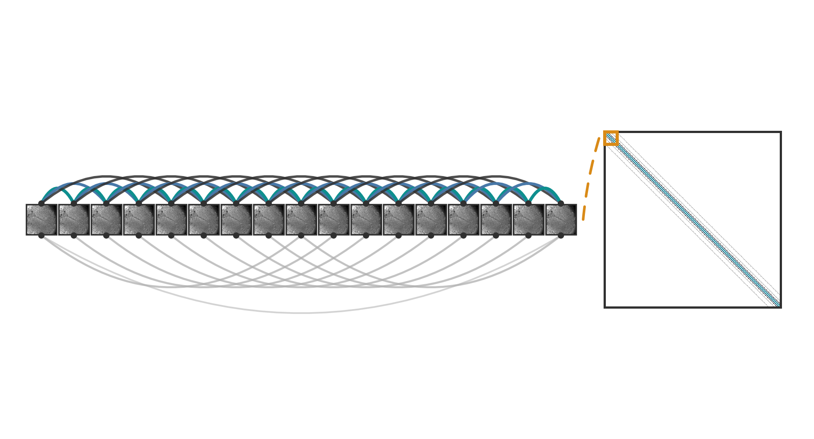

Seventeen consecutive frames of the recording with every planned comparison that falls inside them: neighbouring links above, the longer skipping links below, paler as the lag grows. Right is the same plan for all 240 frames as an adjacency map - five diagonals, one per lag - with the seventeen-frame window marked. The plan is frozen before any pixels are read, so workers may finish in any order and still return to the same slots.

Bundle: [`04-plan-frame-pair-graph/`](04-plan-frame-pair-graph/README.md)

## 5. Separate global gain from movement

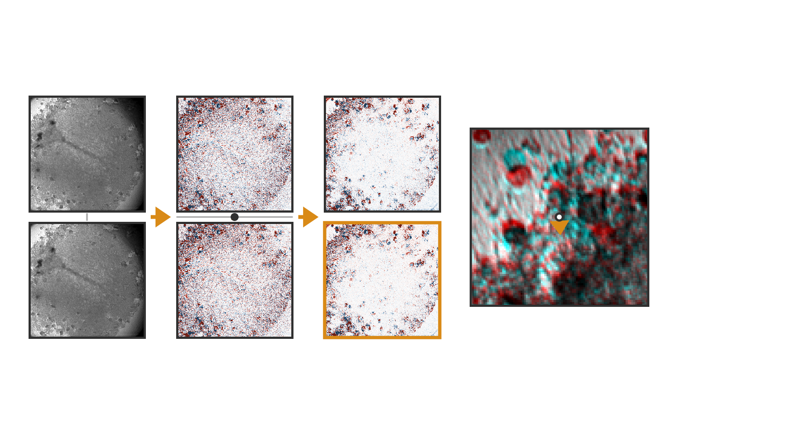

The two real frames of the chosen comparison, then their log difference at zero displacement and the same difference once the median frame-wide offset - the one number the orange marker stands for - has been subtracted. The right pair repeats that at the fitted displacement: the field flattens because the frames now overlap, not because anything was brightened. Far right, a zoomed crop with the first frame in cyan and the second in red, and the measured displacement drawn at six times its own size so a movement of a few pixels is visible at all.

Bundle: [`05-separate-gain-from-movement/`](05-separate-gain-from-movement/README.md)

## 6. Solve the log-ratio fit robustly

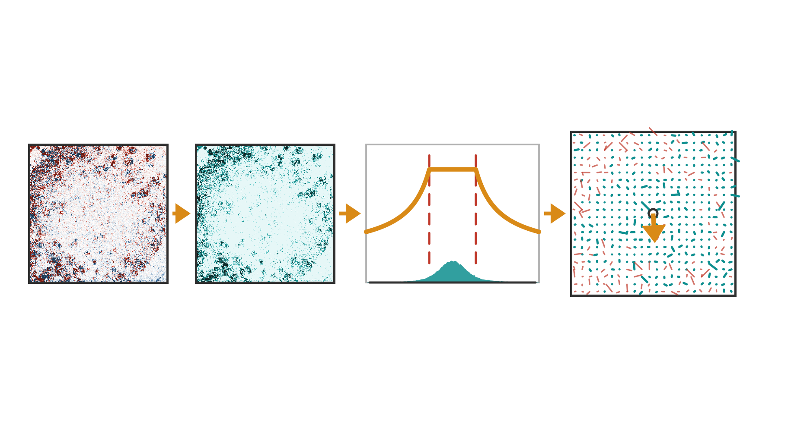

The residual field the solver sees, then the weight it gives every one of those residuals: bright where the residual is small enough to count in full, dark where it has been bounded. The gate itself is drawn at the robust scale this pair produced, with the residual distribution underneath it and the knee marked where bounding begins. Right, the displacement each surviving pixel votes for, on a sampled grid, teal at full weight and red where the weight was cut; the arrow from the centre is the displacement they agreed on.

Bundle: [`06-robust-log-ratio-solve/`](06-robust-log-ratio-solve/README.md)

## 7. Alternatively fit normalised area correlation

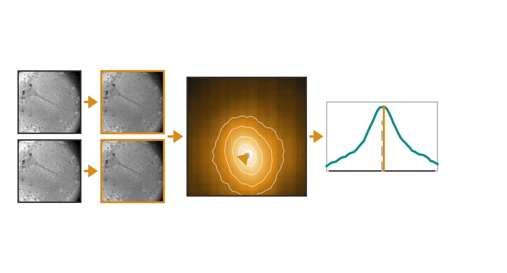

The two comparison windows as measured, drawn on one shared scale so any difference in level or contrast between them would show, then the same windows with each one's mean removed and its energy divided out. For this pair the two differ in level by well under one percent, so normalisation changes little here - it earns its place on recordings where the lamp or the exposure moves. The field is the real zero-mean normalised correlation at every displacement on a quarter-pixel grid, brightest at the best match, with the integer starting position hollow and the orange arrow the Newton step from it. The slice on the right is one line through that peak: the dashed grey mark is where an integer search would have stopped and the orange mark is where the subpixel step ended.

Bundle: [`07-normalised-area-correlation/`](07-normalised-area-correlation/README.md)

## 8. Select informative pixels and refit

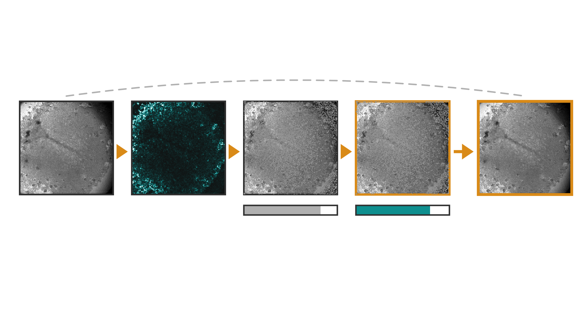

The plane a pilot registration has already aligned, then its two-directional structure score, bright only where intensity changes along both axes rather than along a single edge. The third tile greys out the pixels the gradient floor and the removal quantile discard; the fourth shows the same mask carried onto the second frame by the pilot trajectory - only 1.7 pixels of transport here, so the two masks sit almost on top of one another. The bars are the share of the frame each stage keeps. The final fit runs on the original unfiltered intensities - the score decides where to look, not what is fitted.

Bundle: [`08-informative-pixel-refit/`](08-informative-pixel-refit/README.md)

## 9. Reconcile the pairwise movements

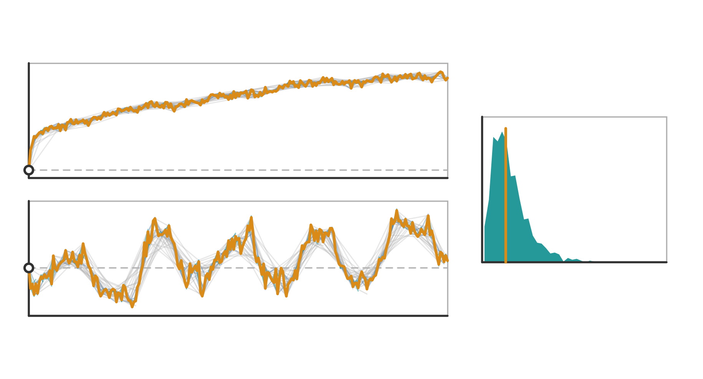

Horizontal displacement above and vertical below, across all 240 frames. Each faint line is one measured frame pair, drawn from where the trajectory puts its first frame to where that pair alone would put its second; they disagree by small amounts and in every direction. The orange line is the single trajectory that fits all of them at once, anchored at the first frame. Right is how far each pair ended from that trajectory, with the median marked - the disagreement is spread across the graph rather than inherited from any one comparison.

Bundle: [`09-reconcile-pairwise-movements/`](09-reconcile-pairwise-movements/README.md)

## 10. Repair unsupported frames and assemble diagnostics

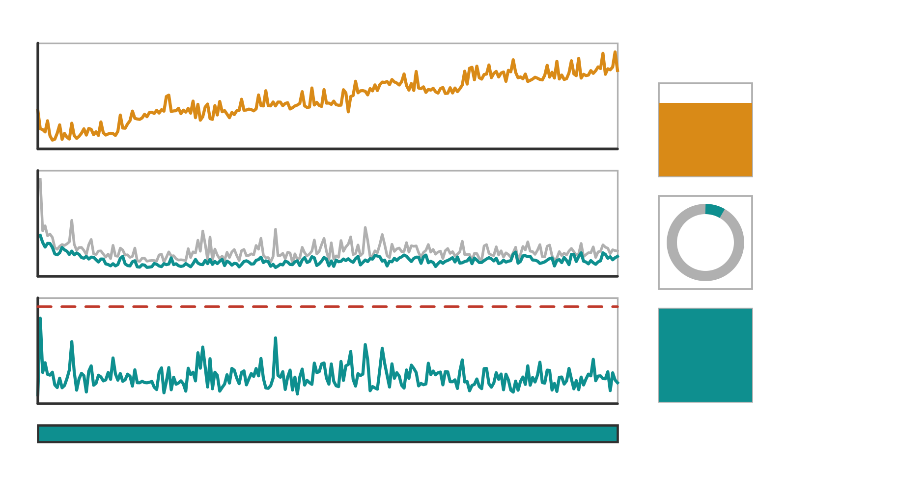

Top, the cumulative frame-wide brightness the estimator profiled out over five days: it is a diagnostic of the estimation channel and is never applied to the output pixels. Middle, how much the estimator's own images disagreed before the fitted movement and after it. Bottom, the frame-to-frame step of the trajectory against the outlier threshold, with the strip beneath showing what each frame's position finally rests on - teal for a direct measurement, red for a repaired one. In this recording nothing needed repairing: every one of the 1169 planned comparisons fitted, no step crosses the threshold, and the strip is unbroken teal. The three tokens repeat the same diagnostics compactly: the brightness left at the end, the share of log disagreement the fit removed, and the share of frames that needed no repair.

Bundle: [`10-repair-and-diagnostics/`](10-repair-and-diagnostics/README.md)

## 11. Warp the untouched stack and crop the common field

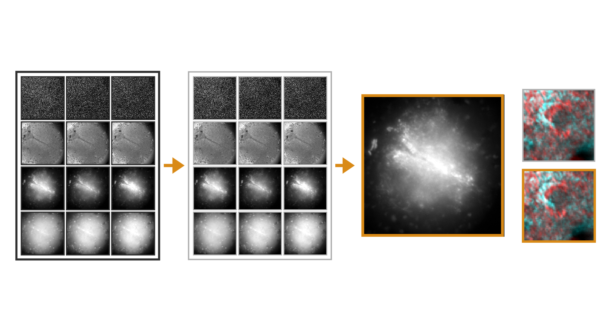

The untouched hyperstack on the left, four channels down and first, middle and last timepoint across. The same grid in the middle after each timepoint's transform has been applied identically to every channel, with the grey edge each displacement leaves behind. The large tile is one of those warped frames with the common valid field marked: the rectangle that holds real source pixels at every timepoint. That rectangle sits close to the frame edge because the drift is small - four columns are lost on the right and one row top and bottom, leaving 508 by 510 of 512 by 512. The two small tiles are the check: a 64-pixel window on the most textured part of the brightfield frame, first timepoint in cyan against last in red, before the transform and after it.

Bundle: [`11-warp-and-crop/`](11-warp-and-crop/README.md)


## Rebuilding

Every figure rebuilds on its own:

```
python <concept folder>/code/plot.py
```

which reads only that bundle's `data/der/` and rewrites its own master and
`data/der/figure_data.csv`. The two scripts that produced those intermediates in the
first place - the whole-recording registration run and the per-step capture - are
copied into every bundle's `data/src/` beside the engine modules they call, so the
chain from the recording to the figure is readable without leaving the folder.

The recording is not copied: at 569 MB it is identified by SHA256 in each bundle's
`data/src/recording_provenance.json`.
