# Log-Ratio Registration concept illustrations

Eleven text-free raster illustrations matching the execution order in
[`log_ratio_registration_concepts_explained.md`](../../log_ratio_registration_concepts_explained.md).
They explain the method rather than the current Fiji interface, so the same assets can accompany a
Java, Python or R implementation.

## 1. Resolve the measurement plane and recipe

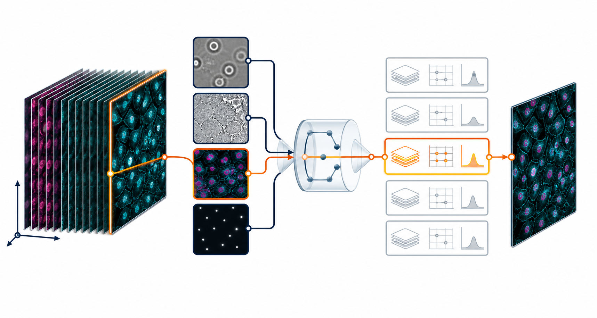

One channel and focal plane are selected, then declared image appearance and motion determine the
registration recipe.

## 2. Prepare estimation images and take logarithms

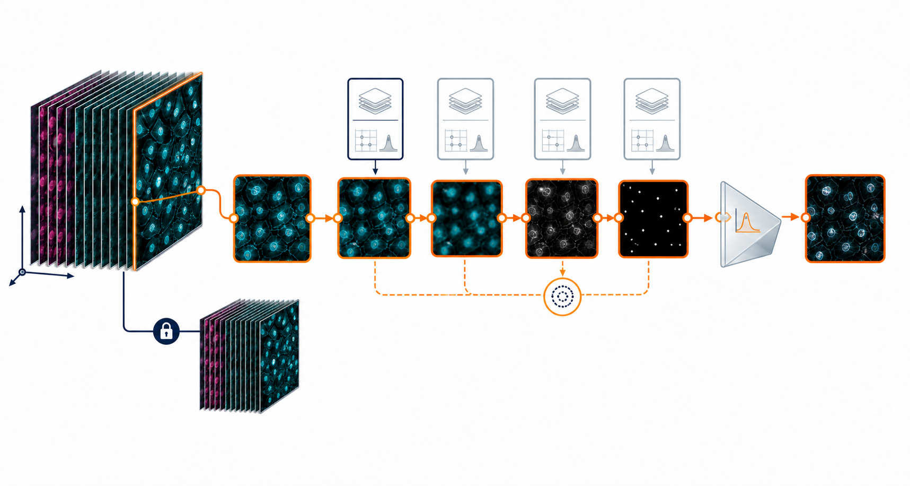

Filtering, scaling, background handling, masking and logarithms affect the estimation copy while the
source stack remains untouched.

## 3. Set the search range and build pyramids

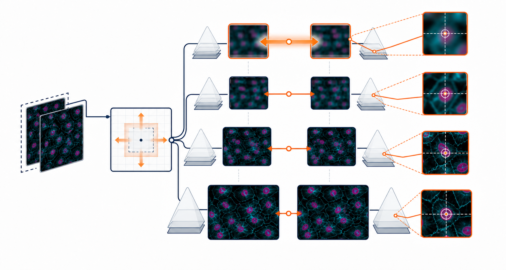

A coarse pilot supplies a safe movement bound; progressively finer pyramid levels refine the
translation.

## 4. Plan the frame-pair graph

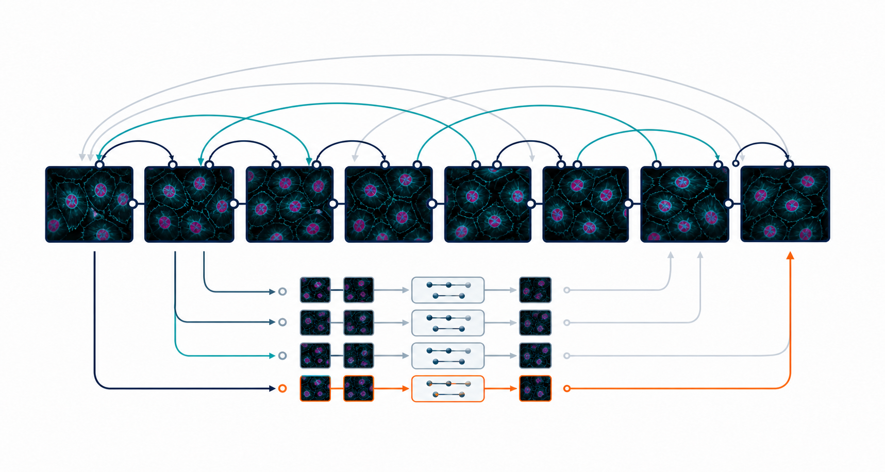

Short- and long-lag comparisons provide redundant routes through the time-lapse and are processed in a
fixed order.

## 5. Separate global gain from movement

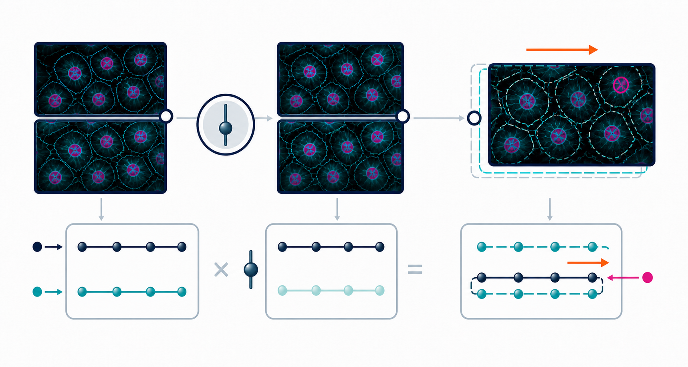

One frame-wide brightness factor is removed from the alignment score; local biological change remains
local evidence rather than being mistaken for global gain.

## 6. Solve the log-ratio fit robustly

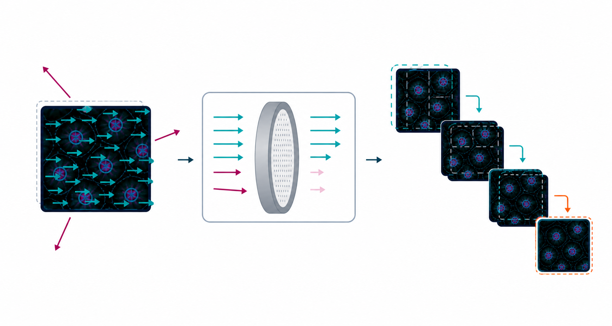

Many consistent spatial votes retain their influence while a few large change-driven votes are
downweighted before coarse-to-fine refinement.

## 7. Alternatively fit normalized area correlation

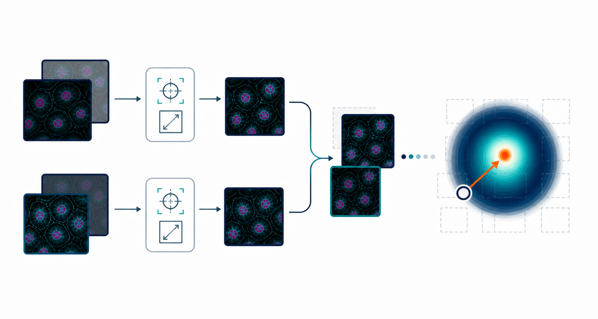

The alternative estimator normalizes whole windows, searches their overlap and refines the selected
correlation peak.

## 8. Select informative pixels and refit

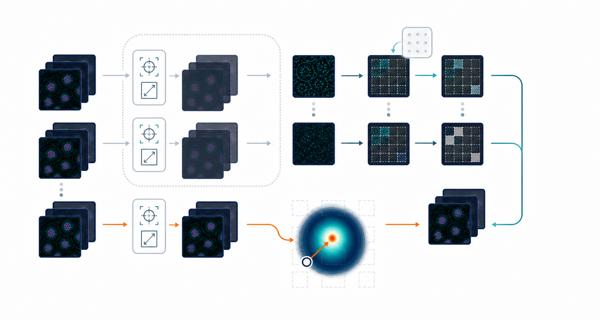

A pilot trajectory transports a localisability mask through time; the final fit uses selected locations
but returns to the original unfiltered intensities.

## 9. Reconcile pairwise movements

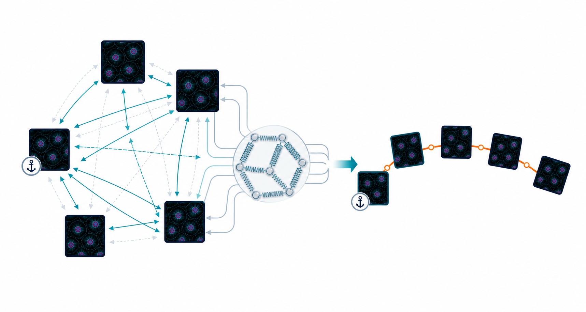

Slightly inconsistent pairwise translations are balanced together while the first frame fixes the
trajectory origin.

## 10. Repair unsupported frames and assemble diagnostics

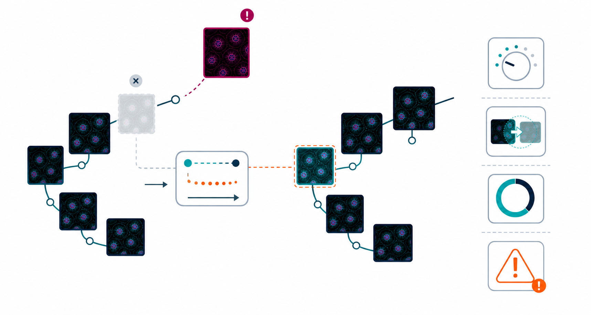

Unsupported and outlying positions are visibly distinguished from direct measurements, then filled by
temporal interpolation; gain, residual support and status remain diagnostics only.

## 11. Warp the untouched stack and crop the common field

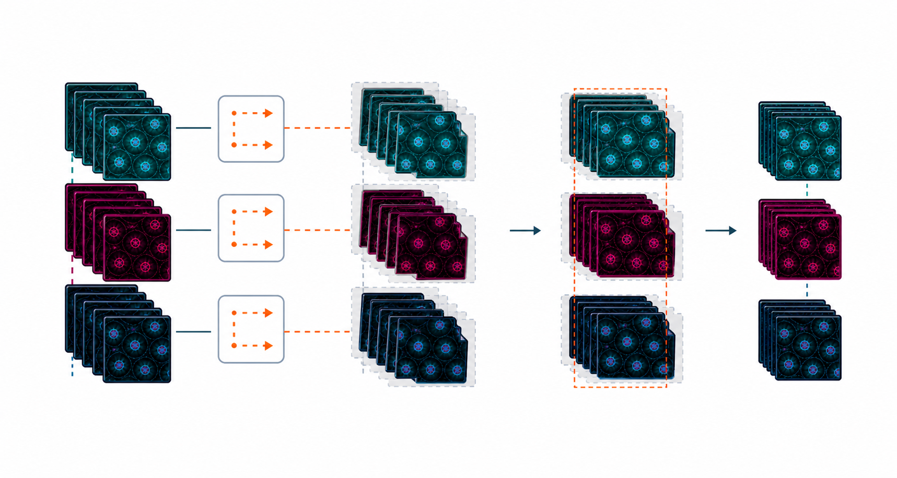

The repaired native-scale trajectory is applied identically across the untouched hyperstack, and only
the field containing source data at every time point is retained.

The reproducible generation brief is in [`PROMPTS.md`](PROMPTS.md).
